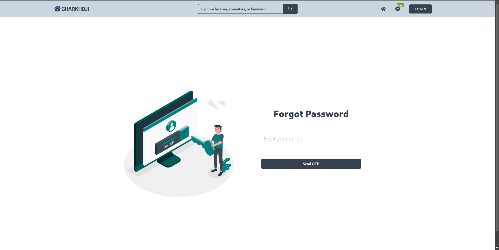
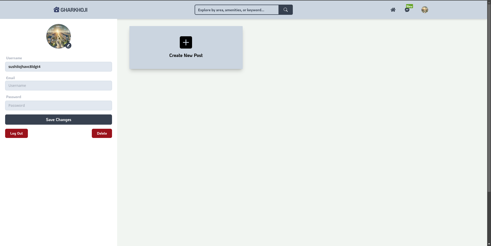
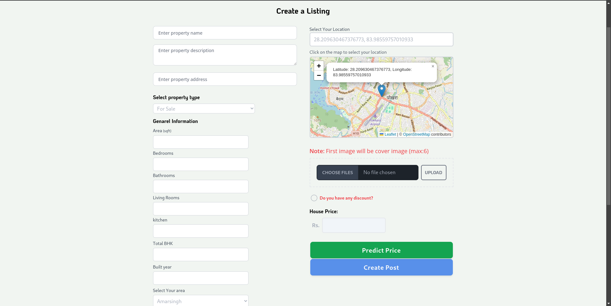
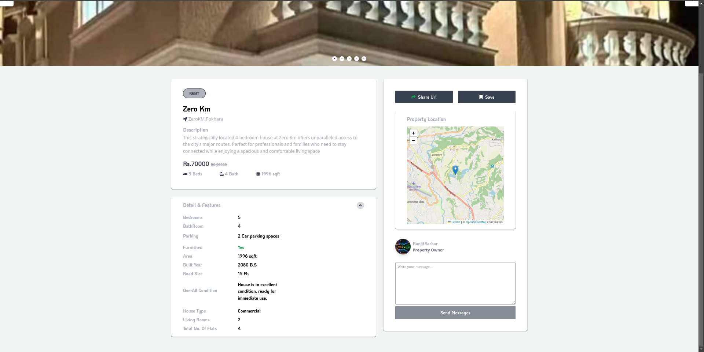

# Real Estate Platform with House Price Prediction and real time chat system using MERN stack

## Overview

This project is a comprehensive real estate platform that features a real-time chat application and a house price prediction model. The platform is designed to facilitate seamless communication between buyers and sellers while providing accurate price predictions to assist users in making informed decisions.

## Features

- **Real-Time Chat:** Enables instant messaging between buyers and sellers, improving communication and decision-making.
- **House Price Prediction:** Predicts property prices based on various features using a machine learning model developed in Python.
- **User-Friendly Interface:** Designed with a clean and intuitive user interface using the MERN stack (MongoDB, Express.js, React.js, Node.js).
- **Secure and Scalable:** Built with security best practices and scalability in mind to handle increasing data and user traffic.

## Technologies Used

- **Frontend:** React.js
- **Backend:** Node.js, Express.js
- **Database:** MongoDB
- **Machine Learning:** Python, with models trained using techniques such as LightGBM and XGBoost
- **Real-Time Communication:** Socket.io for real-time chat functionality


## Installation

### Prerequisites

- Node.js and npm installed
- Python and `venv` for creating a virtual environment
- MongoDB instance running (local or cloud)
- firebase for authentication
- `.env` files with necessary credentials for both the frontend and backend
## Project Overview

Here are some images showcasing the project:











### Clone the Repository

To get started, clone the repository to your local machine:

```bash
git clone https://github.com/suss58/Gharkhoji--Real-estate-web-application-with-real-time-chat-system-and-house-price-prediction-system.git
```

### Install Dependencies

#### Backend (API)

1. **Navigate to the `api` directory:**

    ```bash
    cd api
    ```

2. **Install Node.js dependencies:**

    ```bash
    npm install
    ```

3. **Create a Python virtual environment:**

    ```bash
    python -m venv venv
    ```

4. **Activate the virtual environment:**
    - On Windows:

        ```bash
        venv\Scripts\activate
        ```
    - On macOS/Linux:

        ```bash
        source venv/bin/activate
        ```

5. **Install Python dependencies:**

    ```bash
    pip install -r requirements.txt
    ```

6. Set up the `.env` file with your credentials.NODE_ENV, 
PORT, 
MONGO cluster url, 
JWT_SECRET, 
EMAIL_USER, 
EMAIL_PASS. 


#### Frontend (Client)

1. **Navigate to the `client` directory:**

    ```bash
    cd ../client
    ```

2. **Install Node.js dependencies:**

    ```bash
    npm install
    ```


### Running the Project

1. **Start the backend (API):**

    ```bash
    cd ../api
    npm start
    ```

2. **Start the frontend (Client):**

    ```bash
    cd ../client
    npm start
    ```

3. **Open your browser and navigate to** [http://localhost:3000](http://localhost:3000) **to access the platform.**

## Contributing

If you want to contribute to this project, please follow these steps:

1. Fork the repository.
2. Create a new branch (`git checkout -b feature/YourFeature`).
3. Commit your changes (`git commit -am 'Add some feature'`).
4. Push to the branch (`git push origin feature/YourFeature`).
5. Create a new Pull Request.

## License

This project is licensed under the MIT License - see the [LICENSE](LICENSE) file for details.

## Acknowledgements

- Thanks to the creators of the technologies used in this project.
- Special thanks to our contributors and testers:
  - [Bishwo Subedi](https://github.com/BishwoSubedi)
  - [Ranjit Poudel](https://github.com/RpRanjit)
